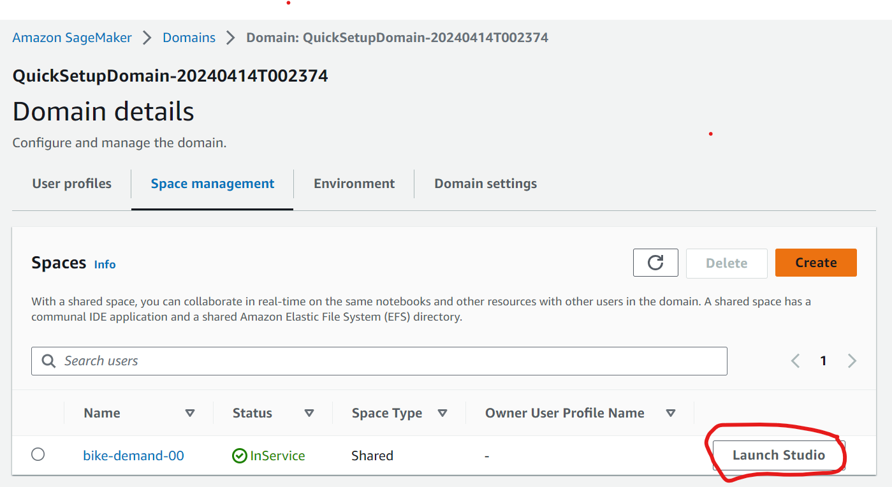
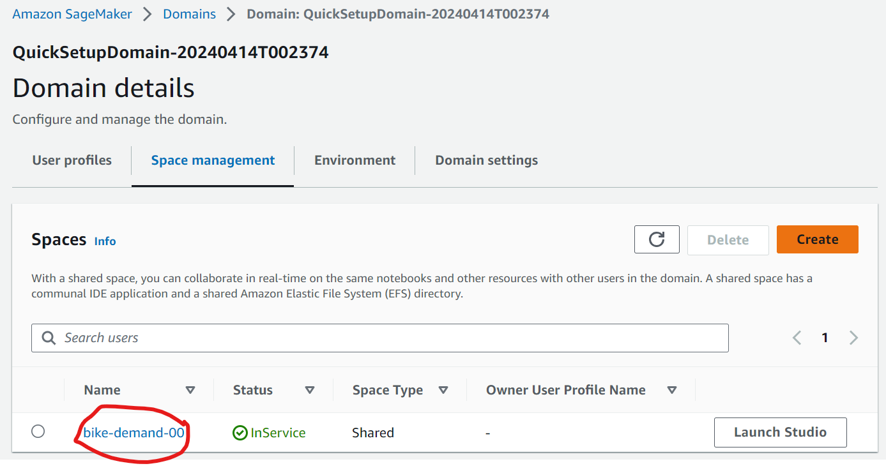
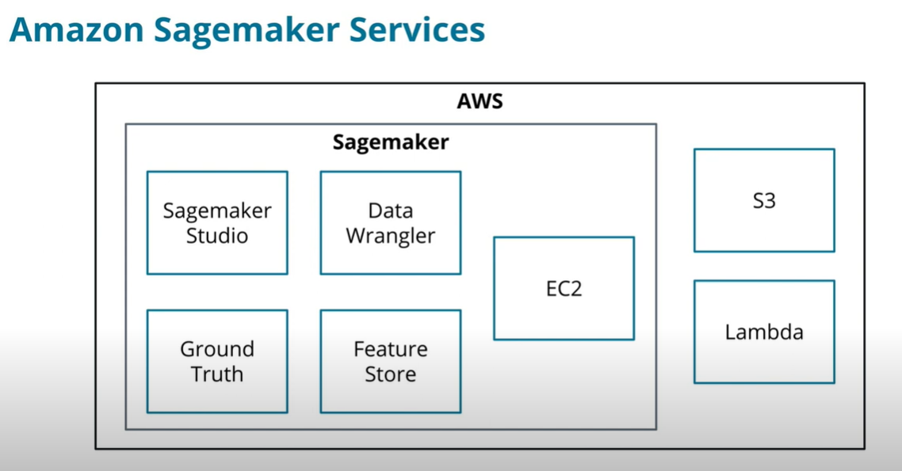

## Launcing Sagemaker

Amazon SageMaker > Domains >Domain: QuickSetupDomain-20240414T002374 > space management > <spaces name> > launch studio




## Delete Apps to Save costs

Click the space


Scroll down and click the app to delete


## Definitions

- __Machine learning__ is a subfield of artificial intelligence, which is broadly defined as the capability of a machine to imitate intelligent human behavior.
- __Artificial intelligence__ systems are used to perform complex tasks in a way that is similar to how humans solve problems.

## How does one tech a computer

- The idea was can we create instructions for the computer to create their own set of instructions
- Eventually, we started to teach computers, that with enough data, and the right set of instructions, they can engineer their own instructions

## Machine Learning is Everywhere

- Reccomender systems on youtube, or spotify
- Medical field in medical imaging in CT and MIR scans

## Useful links

- [Elements of statistical learning](https://web.stanford.edu/~hastie/ElemStatLearn/)
- [Introduction to machine learning](https://www.statlearning.com/)


## Sagemaker 

AWS machine learning service

1. Using Sagemaker studio
    - use it to access datasets from S3 and perform data analysis and functions in AWS tools
    - perform data analysis and feature engineering with Data Wrangler
    - perform data analysis and feature engineering with pandas in sagemaker studio
    - label new data for a dataset using Sagemaker ground truth
2. Differenciate scenarios where ML can be used
    - design a domain data, and model outline for a case study
    - build ML life cycle and apply to dataset
    - differenciate between supervised and unsupervised models and apply them to an appropriate dataset
    - differenciate between regression and classification models
3. Build maching learning models using Sagemaker tools
    - load dataset, create 3 data set types, identify features/values in SageMaker
    - create new features from data
    - train (fit) a regression and classifcation model using sklearn
    - evaluate a trained model using metrics like MSE, RMSE, r2, accuracy, precision, f1


## Prerequistes

1. [python3 tutorial](https://docs.python.org/3/tutorial/)
2. [pandas tutorial](https://pandas.pydata.org/docs/getting_started/intro_tutorials/index.html)
3. [jupyterlab](https://jupyterlab.readthedocs.io/en/stable/)

## Business Stakeholders

- __Executives__ - they create the KPIs for their business to succeed.
Product managers (PMs) - work with engineers and users of their platform to improve the overall product.
- __Engineers__ - main stakeholders of the product. They design and build the product that machine learning will integrate with, they are the ones that make the model come to life.
- __Data scientists (DS)__ - owners of the data that powers machine learning. They often provide insights or initial models that will need to be integrated into the main product.

## History of ML

Brief Timeline of Machine Learning

- 1943 - Warren McCulloch and Walter Pitts created a model for neural networks.
- 1950 - Alan Turing published a paper called "Computing Machinery and Intelligence".
- 1959 - Arthur Samuel popularized the phrase machine learning.
- 1965 - Alexey Ivakhnenko and fellow researchers created the first working deep learning networks.
- 1970 - 1980 - ID3 and DART decision tree algorithms were created.
- 1998 - Yann LeCun created the stochastic gradient descent algorithm
- 2011 - Alex Krizhevsky created the AlexNet neural network

Present day - GPUs and TPUs power a larger portion of machine learning. Large option of frameworks and libraries for ML.

[History of deep learning](https://www.import.io/post/history-of-deep-learning/)
[Google interactive timeline](https://cloud.withgoogle.com/build/data-analytics/explore-history-machine-learning/)

## When To Use ML

1. Define Problem
Without a clear definition of what you are trying to solve, it is difficult to build a machine learning model.

2. Measurable Outcome
Machine learning is built around learning objectives. Objectives need some way of showing that the model is learning, which is where metrics come into play.

3. Not Simple Solution
Simple solutions can often be built using traditional engineering. Machine learning's performance really proves itself when used on complex problems that individuals find difficult to complete.

4. Feasibility
If aspects of the machine learning problem are completely impossible, there is no sense in spending time and research for a solution. Working with business stakeholders will assist in proving the reality of a successful outcome.

## Tools and Environment

1. [excersize and template files](https://github.com/udacity/cd0385-exercise-files)
2. [project template](https://github.com/udacity/cd0385-project-starter)

## Introduction to SageMaker

[Sagemaker AWS docs](https://aws.amazon.com/sagemaker/features/)



|Sagemaker service| Description |
|-----------------|-------------|
|Sagemaker studio| cloud based IDE focused on jupyterlab, and do the whole ML lifecycle, and share and collaborate the cloud|
|Data wrangler| perform EDA, feature engineering, and get insights in the IDE|
|Ground truth| provides the infastructure to complete annotating data end to end |
|Feature store| Feature Store manages all of your features, providing a centralized location to store, update, share, and obtain features.|
|Training pipeline/Endpoint| EC2 instance (), S3 (object store), lambda (serverless computing, small bits of code that you can glue together) |

## Dataframes

- DataFrames are a container for your data
- Rows are individual events
- Columns are features and target values
- The index is the row's unique ID, making it easier to find a row individually

```python
## Creating a simple DataFrame from a dictionary of values
import pandas as pd

df = pd.DataFrame(
  {
    'a': [1, 2, 3, 4, 5],
    'b': ['a', 'b', 'c', 'd', 'f'],
    'c': [5, 4, 3, 2, 1],
  }
)
```

`df.describe()` provides summary statistics
For numerical values, it provides data for each feature:

count - number of rows
mean - average value
std - standard deviation
min - minimum value
25/50/75% - percentile values
max - maximum value

```python
print(df.describe())

              a         c
count  5.000000  5.000000
mean   3.000000  3.000000
std    1.581139  1.581139
min    1.000000  1.000000
25%    2.000000  2.000000
50%    3.000000  3.000000
75%    4.000000  4.000000
max    5.000000  5.000000
```

`df.hist()` plots histograms
- Plot the distribution of values
- Help identify outliers or unexpected values
- Normal, Uniform, chi-square, F are examples of different distributions


`df.corr()` calculates a correlation matrix
- Correlation is the relationship between two variables
- Values from correlation range from -1.0 to 1.0
- -1.0 is a strong negative relationship
- 1.0 is a strong positive relationship
- Diagonal matrix values always 1.0
- Strong positive or negative relationships add little to ML models

```python
print(df.corr())
"""
     a    c
a  1.0 -1.0
c -1.0  1.0
"""
```

Information Gain - one piece of information would be to check outside if its raining, and the other is checking your weather app using both would not be useful